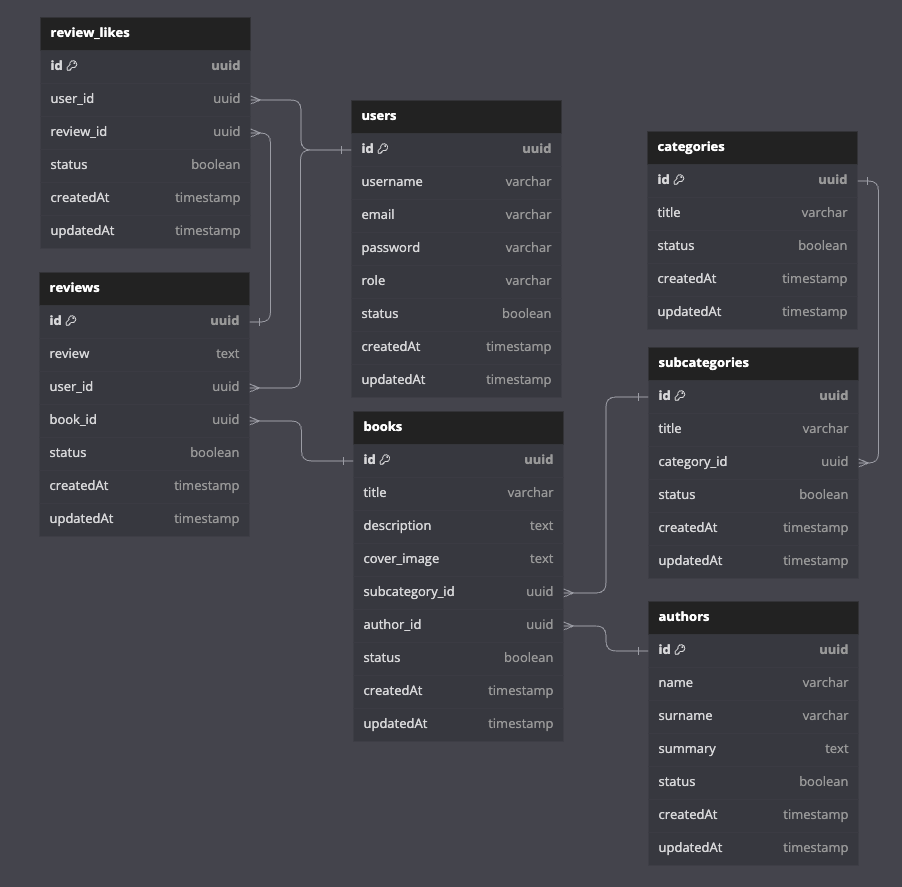

# Book Reviews API

This API helps you to serve book reviews in a simple way.

## Installation

You can get the project up and running by following the steps below.

Make sure to fill in your configuration details in the .env file before running the application.

```sh
  git clone https://github.com/oteuzay/book-reviews-api.git
```

```sh
  cd book-reviews-api
```

```sh
  cp .env.example .env
```

```sh
  pnpm install
```

```sh
  pnpm start
```

## Documentation

When you set `NODE_ENV` to `Development` in your environment variables, you gain access to the Swagger documentation.

The Swagger documentation can be found at the following endpoint:

`/api-docs`

## Diagrams

### Database Diagram



## Issues

Feel free to create an issue in our repository for any problems, questions, or feedback you have.

## Contributing

We welcome contributions, new features, improvements, and feedback.

Please fork the repository, make your changes, and submit a pull request for consideration.
